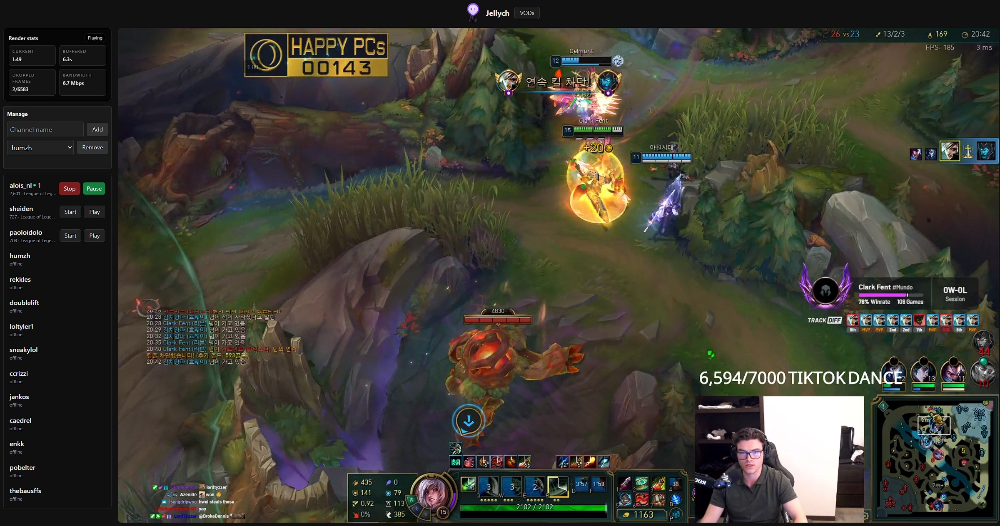

# Jellych

A lightweight server that leverages [`ffmpeg`](https://github.com/ffmpeg/ffmpeg) to stream Twitch livestreams via `Web-UI` and `Jellyfin` (*requires [Jellyfin Plugin](https://github.com/c2bw/jellyfin-plugin-jellych)*).

It can also download Twitch VODs which can then be watched in Jellyfin/Jellych.



## Configuration


Required environment variables:

- `TWITCH_CLIENT_ID` for Twitch API access, register an application on the [Twitch Developer Portal](https://dev.twitch.tv/console/apps)
- `TWITCH_CLIENT_SECRET` for Twitch API access, register an application on the [Twitch Developer Portal](https://dev.twitch.tv/console/apps)
- `SERVER_URL` publicly accessible URL where the server is reachable, also used for Jellyfin webhook
- `JELLYFIN_WEBHOOK_SECRET` shared secret expected on `X-Jellych-Secret`

Optional environment variables:

- `LOG_LEVEL` logging level (default `INFO`)
- `VOD_RETENTION_DAYS` number of days to keep downloaded VOD files (default `30`, must be a positive integer)

Optional flags:

- `-addr` (default `:8080`) HTTP listen address. The Docker image health check
  probes `http://127.0.0.1:8080/health`, so container deployments must keep
  the internal listen port at `8080` or override/disable the image health check.
- `-config` (default `/data/config`) directory containing the persistent `jellych.db` SQLite configuration database
- `-vods` folder where manually downloaded VODs are saved

The VOD page can download directly as Original, H.264, HEVC, or VP9. A completed Original download can later be converted once to any compressed preset from its codec selector. Conversion replaces the original only after the new MKV is complete, and converted entries show both original and converted file sizes.

## Run

### Docker Compose Example

```bash
services:
  jellych:
    image: ghcr.io/c2bw/jellych:latest
    restart: unless-stopped
    environment:
      - LOG_LEVEL=INFO
      - VOD_RETENTION_DAYS=30
      # https://dev.twitch.tv/docs/api/get-started/
      - TWITCH_CLIENT_ID=your_client_id
      - TWITCH_CLIENT_SECRET=your_client_secret
      - SERVER_URL=http://localhost:8080
      - JELLYFIN_WEBHOOK_SECRET=replace_me
    ports:
      - "8080:8080"
    volumes:
      - config_volume:/data/config
      - vods_volume:/data/vods

volumes:
  vods_volume:
  config_volume:
```

## Configure Jellyfin

- Dashboard > Live TV > Add Tuner Device > M3U Tuner -> Then enter the URL to your server's `/api/twitch.m3u` endpoint, e.g. `http://localhost:8080/api/twitch.m3u`
- Dashboard > Scheduled Tasks > Refresh Guide -> Every 15 minutes
- *OPTIONAL: create a library for the VODs folder*
- Install Jellyfin plugin: https://github.com/c2bw/jellyfin-plugin-jellych

### Jellyfin VODs library setup

The VODs library is optional, but it allows to watch Twitch VODs in Jellyfin. To set it up, create a new library in Jellyfin and point it to the folder where VODs are saved (the `-vods` folder). After that, configure the library:

- Dashboard > Libraries > Manage Library -> remove all metadata downloaders; select only `screen grabber` for the remaining options
- Select `Prefer embedded titles over filenames` to have the VOD title displayed in Jellyfin instead of the filename (requires rescan if the VODs were already downloaded)
